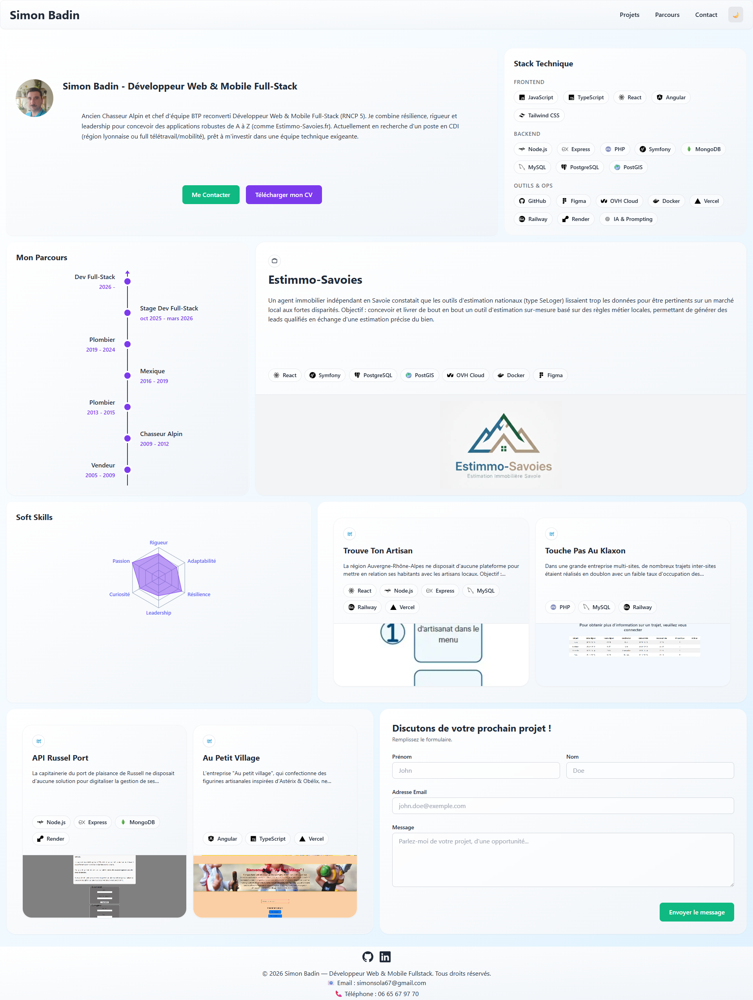
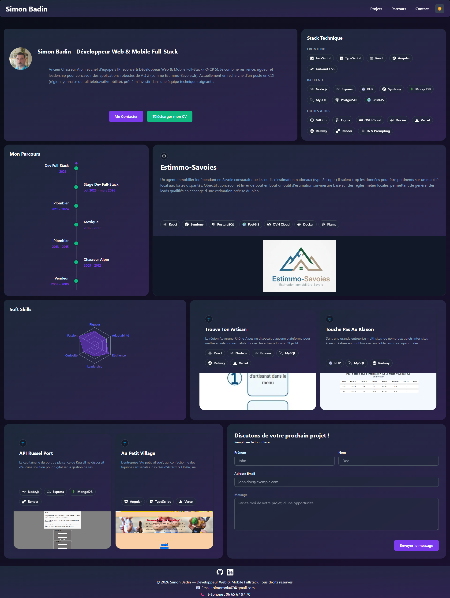
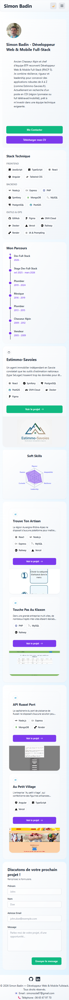
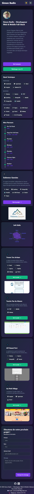

# 🎨 Portfolio de Simon Badin — V3 (React / Vite)


Portfolio personnel présentant mon parcours, mes compétences techniques et mes projets, avec formulaire de contact fonctionnel et téléchargement direct du CV.

🔗 **Lien du site en ligne :** [simon69500.github.io/Portfolio-Simon](https://simon69500.github.io/Portfolio-Simon/)

## Sommaire

- [Aperçu](#-aperçu)
- [Nouveautés de la V3](#-nouveautés-de-la-v3-vs-v2)
- [Fonctionnalités](#️-fonctionnalités)
- [Stack technique](#️-stack-technique)
- [Architecture des composants](#-architecture-des-composants)
- [Structure du projet](#-structure-du-projet)
- [Installation et exécution](#-installation-et-exécution)
- [Variables d'environnement](#-variables-denvironnement)
- [Scripts disponibles](#-scripts-disponibles)
- [Déploiement](#-déploiement)
- [Points d'attention](#️-points-dattention)
- [Me contacter](#-me-contacter)

---

## 🌟 Aperçu

### Desktop — clair / sombre




### Mobile — clair / sombre

 

---

## 🆕 Nouveautés de la V3 (vs V2)

La V2 était une application multi-pages en SCSS/Bootstrap (Create React App). La V3 est une **refonte complète** :

| | V2 | V3 |
|---|---|---|
| Build tool | Create React App | **Vite** |
| Styles | SCSS + Bootstrap | **Tailwind CSS** |
| Architecture | Multi-pages (Accueil / Compétences / Portfolio / Contact) | **SPA one-page** en grille Bento, navigation par ancres |
| Thème | Non disponible | **Mode clair/sombre**, détection système + préférence mémorisée |
| Fiches projets | Page dédiée par projet | **Cartes extensibles** in-page, avec vue enrichie pour le projet phare |
| Compétences | Liste statique | **Radar chart interactif** (soft skills) + badges technologiques catégorisés |
| Contact | Formulaire | Formulaire avec **validation temps réel** + envoi via **Formspree** |
| Animations | — | **Motion** (Framer Motion) |

## ⚙️ Fonctionnalités

- **Architecture SPA one-page** en grille Bento : présentation, stack technique, parcours, soft skills, projets et contact sont toutes des tuiles d'une seule page, reliées par une navigation par ancres (`#projets`, `#parcours`, `#contact`)
- **Mode clair / sombre** : au premier chargement, détection de la préférence système (`prefers-color-scheme`) ; ensuite, le choix de l'utilisateur est mémorisé dans `localStorage`
- **Header sticky** avec menu burger accessible sur mobile (`aria-expanded`, `aria-label`) et fermeture automatique du menu au clic sur un lien d'ancre
- **Cartes projets extensibles** : chaque tuile projet s'ouvre en vue détaillée (contexte, stack, défis, solutions, résultats) sans navigation de page ; l'ouverture verrouille le scroll de la page (scroll lock) pour un comportement proche d'une modale
- **Vue enrichie pour le projet phare** (Estimmo-Savoies) : au-delà de la fiche standard, affichage de métriques d'usage réelles, du rôle tenu sur le projet, et d'un média de démonstration
- **Radar chart des soft skills** (Rigueur, Adaptabilité, Résilience, Leadership, Curiosité, Passion), affiché via Recharts
- **Formulaire de contact fonctionnel**, avec validation en temps réel (prénom/nom ≥ 2 caractères, email au bon format, message ≥ 15 caractères), gestion des états `idle` / `loading` / `success` / `error`, envoi via Formspree
- **Téléchargement direct du CV** au format PDF
- **Responsive design**, du mobile au grand écran
- **Page Mentions légales** dédiée, accessible depuis le footer

## 🛠️ Stack technique

| Domaine | Choix technique |
|---|---|
| Framework | React 18 |
| Build tool | Vite |
| Styles | Tailwind CSS |
| Animations | Motion (Framer Motion) |
| Graphiques | Recharts (radar chart des soft skills) |
| Formulaire de contact | Formspree |
| Hébergement | GitHub Pages (via `gh-pages`) |

## 🧩 Architecture des composants

Le projet suit une organisation par rôle plutôt que par page, cohérente avec l'architecture one-page :

- **`components/Pages/`** — les deux seules "pages" au sens propre : `Home.jsx` (page unique regroupant toutes les tuiles) et `Mentions.jsx` (mentions légales)
- **`components/bento/`** — une tuile de la grille = un composant : `Presentation`, `StackCard`, `Parcours`, `SoftSkills`, `ProjetStar` (mise en avant du projet phare), `ProjetDetails`/`ProjetDetailsStar` (vues détaillées), `Contact`, `MosaicContainer` (grille des autres projets)
- **`components/bento/star/`** — sous-composants de la vue détaillée du projet phare : `StarMetrics` (métriques chiffrées), `StarRole` (rôle tenu), `StarNarrative` (récit technique), `StarDemoMedia` (média de démo)
- **`components/ui/`** — composants réutilisables et génériques : `Button`, `InputField`, `TextareaField`, `ProjetCard`, `ProjectCarousel`, `ProjectTypeBadge`, `TechBadge`, `ThemeToggle`, `RadarChartComponent`
- **`components/layouts/`** — `Header` (navigation) et `Footer`
- **`hook/`** — logique métier isolée de l'affichage : `useTheme` (persistance du thème), `useContactForm` (validation + soumission), `useCardExpansion` (état d'ouverture d'une carte projet + scroll lock)
- **`data/`** — contenu du site séparé du code : `profileData.js` (parcours, soft skills), `techData.js` (stack affichée), `projects/portfolioData.js` (contenu des projets), `projects/projectTypeData.js` (catégories de projets)

Cette séparation données/logique/affichage permet de mettre à jour le contenu (un nouveau projet, une compétence) sans toucher aux composants.

## 📁 Structure du projet

```
Portfolio-Simon/
├── public/
│   ├── CV_BADIN_Simon_2026.pdf   # CV téléchargeable depuis le site
│   └── images/, videos/           # Assets des projets
├── src/
│   ├── components/
│   │   ├── Pages/                 # Home.jsx (page unique), Mentions.jsx
│   │   ├── bento/                 # Une tuile de la grille = un composant
│   │   │   └── star/               # Sous-composants du projet phare
│   │   ├── ui/                     # Composants réutilisables
│   │   └── layouts/                # Header, Footer
│   ├── data/
│   │   ├── profileData.js         # Parcours, soft skills
│   │   ├── techData.js            # Stack technique affichée
│   │   └── projects/                # Contenu et catégories des projets
│   ├── hook/
│   │   ├── useTheme.js
│   │   ├── useContactForm.js
│   │   └── useCardExpansion.js
│   └── App.jsx
```

## 🚀 Installation et exécution

```bash
# 1. Cloner le projet
git clone https://github.com/Simon69500/Portfolio-Simon.git
cd Portfolio-Simon

# 2. Installer les dépendances
npm install

# 3. Configurer les variables d'environnement (voir ci-dessous)

# 4. Lancer le serveur de développement
npm run dev
```

## 🔧 Variables d'environnement

Le formulaire de contact envoie les messages via Formspree. Créer un fichier `.env.local` à la racine :

```
VITE_FORMSPREE_ENDPOINT=https://formspree.io/f/ton_id_formspree
```

Sans cette variable, le site fonctionne normalement mais l'envoi du formulaire de contact échouera.

## 📜 Scripts disponibles

| Commande | Description |
|---|---|
| `npm run dev` | Lance le serveur de développement Vite |
| `npm run build` | Build de production dans `dist/` |
| `npm run preview` | Prévisualise le build de production en local |
| `npm run lint` | Vérifie le code avec ESLint |
| `npm run deploy` | Build puis publie `dist/` sur la branche `gh-pages` |

## 🌍 Déploiement

Le site est hébergé sur GitHub Pages. Pour publier une nouvelle version :

```bash
npm run deploy
```

## 📞 Me contacter

📧 [simonsola67@gmail.com](mailto:simonsola67@gmail.com)
🔗 [LinkedIn](https://www.linkedin.com/in/simon-badin-939594279/)
